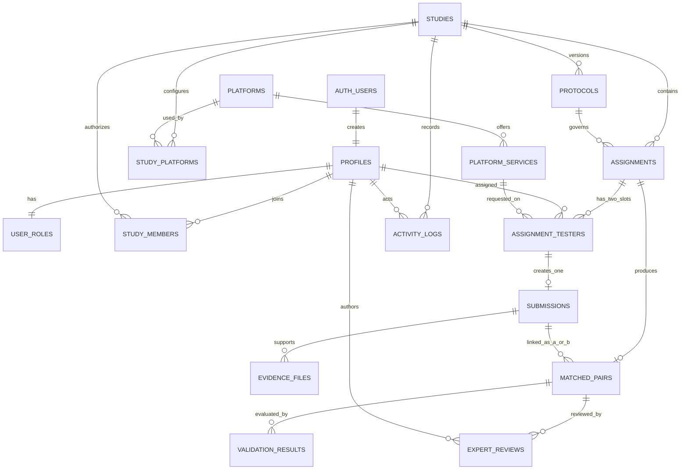

# Database Schema

## Design principles

- UUID primary keys for relational records
- Human-readable unique codes for studies, protocols, assignments, submissions, evidence, and pairs
- Time-zone-aware timestamps
- `numeric` fare values rather than floating-point values
- Three-letter uppercase ISO currency codes
- Stable enums for authorization and workflow statuses
- JSONB only for variable configuration and metadata
- Provider-neutral platform and service tables
- Separate technical-validation and expert-review records
- Indexed foreign keys and common RLS lookup columns
- RLS enabled on every public table

## Tables

### `profiles`

One row per Supabase Auth user. Stores email, optional display name, and `pending`, `active`, or `disabled` account status. The primary key references `auth.users(id)` with cascade deletion.

### `user_roles`

One authoritative global role per profile. Users can read their own role but cannot promote themselves. Roles are never sourced from editable Auth metadata.

### `studies`

Study definition with unique `study_code`, comparison type, lifecycle status, question, isolated variable, target count, currency, time zone, schedule, and variable JSON configuration.

Study types:

- `within_platform_pair`
- `cross_platform_comparison`

### `study_members`

Many-to-many study/user membership with a study role and `invited`, `active`, or `removed` status. `(study_id, user_id)` is the primary key.

### `platforms`

Provider-neutral registry for Grab, JoyRide, inDrive, Uber, Lyft, or another provider. Provider names are data, not column names.

### `platform_services`

Service/tier definitions belonging to a platform, such as a standard ride or another configured service.

### `study_platforms`

Join table allowing one study to use one or multiple platforms. This extra normalized table is required for cross-platform studies.

### `protocols`

Versioned protocol records belonging to a study. Stable relational fields identify version/status/ownership; variable controls, evidence requirements, thresholds, and exclusions use JSONB until builder requirements stabilize.

### `assignments`

Study/protocol-specific testing instruction with unique `assignment_code`, timing, route, isolated variable, instructions, lifecycle status, and creator.

### `assignment_testers`

Exactly two possible slots per assignment: `tester_a` and `tester_b`. Each slot links a real profile and an optional platform service. Different services/platforms across slots support cross-platform comparison.

Unique constraints prevent:

- Two users in the same slot
- One user occupying both slots in one assignment

### `submissions`

One submission per assignment tester slot. Stores decimal fare, currency, quote time, location, device/application fields, account configuration, route, notes, and workflow timestamps.

A composite foreign key proves that the submission's user and assignment match the assigned slot.

### `evidence_files`

Private evidence metadata linked to a submission. Stores the private Storage path, original filename, MIME type, size, optional SHA-256 value, capture/upload times, integrity status, and metadata. It does not make the object public.

### `matched_pairs`

Links two different submissions from the same study and assignment. Stores descriptive fare, time, GPS, technical, and evidence results. One assignment can have one current matched-pair record in Phase 0.

### `validation_results`

Rule-by-rule technical results belonging to a matched pair. Technical results remain separate from expert decisions.

### `expert_reviews`

One review per pair/reviewer with `pending`, `accepted`, `flagged`, or `rejected` status, reason, note, and decision time.

### `activity_logs`

Append-restricted event records that may reference a study, actor, and UUID target. Ordinary authenticated clients receive no insert, update, or delete grant.

## Important enums

| Enum | Values |
|---|---|
| `app_role` | admin, test_coordinator, tester, expert_reviewer, law_firm_viewer |
| `account_status` | pending, active, disabled |
| `membership_status` | invited, active, removed |
| `study_type` | within_platform_pair, cross_platform_comparison |
| `study_status` | draft, active, paused, completed, archived |
| `protocol_status` | draft, active, superseded, archived |
| `tester_slot` | tester_a, tester_b |
| `submission_status` | draft, submitted, withdrawn |
| `pair_validation_status` | pending, valid, warning, invalid, incomplete |
| `rule_status` | pass, warning, fail, not_applicable |
| `review_status` | pending, accepted, flagged, rejected |

## Relationship overview

## Ownership and authorization

- `auth.users` owns authentication identity.
- `profiles` owns activation state and safe display information.
- `user_roles` owns global authorization.
- `study_members` owns study-scoped authorization.
- `assignment_testers` proves tester assignment.
- `submissions.user_id` and composite foreign keys prove submission ownership.
- `evidence_files.uploaded_by` and private object paths prove application-level uploader ownership.
- `expert_reviews.reviewer_id` owns the expert decision.

Client-provided role values are never accepted as authorization.

## Deletion behavior

- Deleting an Auth user cascades to the profile and global role.
- Deleting a study cascades through membership, protocols, assignments, and study workflow records.
- Platform/service references use restrictive deletion where historical records may depend on them.
- Assigned tester/reviewer/evidence user references generally restrict deletion to preserve attribution.
- Creator/approver/actor references may become null where retaining the operational record is more important than retaining the account.

Production retention, legal hold, anonymization, and deletion procedures still require approval before real evidence is collected.
